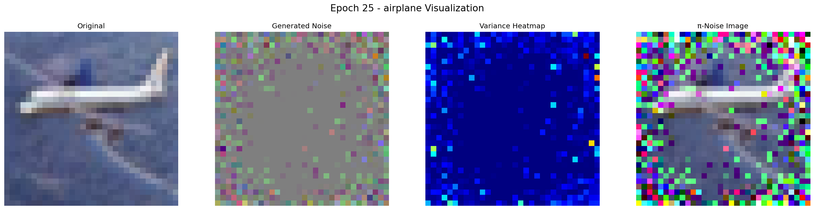

####**Variational Positive-incentive Noise: How Noise Benefits Models**  

This repository contains an **unofficial implementation** of the Variational Pi-Noise (VPN) method described in the paper:

*Authors: Hongyuan Zhang, Sida Huang, Yubin Guo, and Xuelong Li*  
📄 [ArXiv Link](https://arxiv.org/pdf/2306.07651v2) | 🏷️ arXiv:2306.07651v2

## 🚀 Overview

This implementation explores the core VPN framework for generating class-specific noise patterns to enhance model robustness. Key components include:

- Custom CIFAR-10 data loader with normalization
- ResNet-18 base classifier model
- ResNet-18 based VPN generator module
- Variational noise sampling with reparameterization trick
- Joint training pipeline for base model and VPN generator
- Visualization tools for noise patterns and variance heatmaps

## 🧩 Discussion

I implemented the whole framework but it didn't work well, and I speculate on the following reasons: 

- **Noise constraints parameteris unknown** (C1, C2 in original paper)
- **Visualization methods** of noise patterns and variance heatmaps

I'm uploading some of my implementations [code](https://github.com/Panlizhi/VPN/blob/main/Variational%20Positive-incentive%20Noise.ipynb) and expect to get your discussion.

